# Git Flow Plus — Diagrams

All diagrams use [Mermaid](https://mermaid.js.org/) syntax and render
natively on GitHub, in VS Code (with the Mermaid extension), in Obsidian,
and in any standard Markdown pipeline that supports Mermaid — no external
tools needed.

This file is being built **incrementally** across five phases, per the
current documentation initiative:

- [x] **Phase 1 — Architecture diagrams**
- [x] **Phase 2 — Workflow / lifecycle diagrams** (this delivery)
- [ ] Phase 3 — Full documentation set (Architecture.md, Workflow.md,
      DeveloperGuide.md, ReleaseManagerGuide.md, QAProcess.md,
      CommandReference.md, PresentationNotes.md)
- [x] Phase 4 — PowerPoint deck (`GitFlowPlus-Team-Training.pptx`) — the
      in-deck diagrams are native PowerPoint shapes rather than rendered
      Mermaid, for print/screen quality; every one of them is backed by a
      diagram in this file covering the same lifecycle
- [ ] Phase 5 — Live demo script

Every diagram below reflects the **actual current implementation** —
verified directly against the Go source (package imports, service
interfaces, branch/prefix configuration) as of this session, not the
originally-planned design. Where the real codebase includes more than the
minimum described in the request (e.g. `hotfix`/`support` branches, three
long-lived branches rather than two), the diagrams include it, since the
goal is that these match the codebase exactly.

---

## 1. Overall Git Flow Plus Architecture

**Purpose:** the single "explain it in one picture" view — who uses the
tool, what it's built from, and what it talks to. This is the diagram for
an audience that has never seen the tool before.

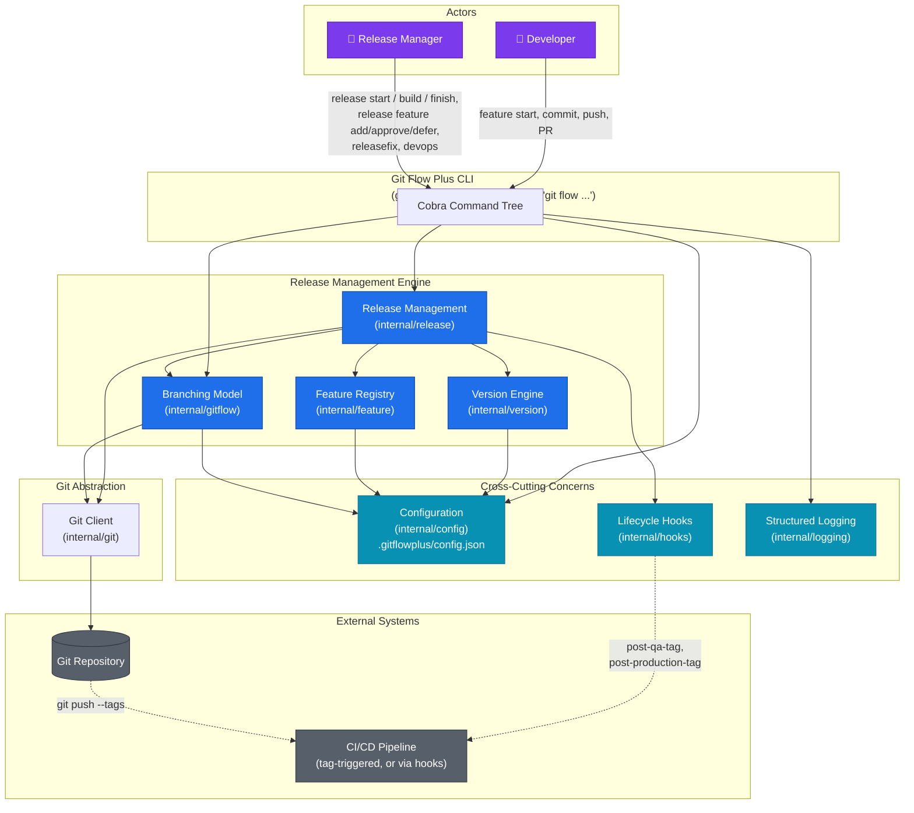

**Key takeaway:** Git Flow Plus is a thin, predictable layer over real
`git` — nothing it does is something a `git` command line couldn't also
do. Every mutation flows through `internal/git`, so the repository stays
100% compatible with GitHub, GitLab, Azure DevOps, and any Git-aware tool.

---

## 2. System Components

**Purpose:** a component-level view for engineers onboarding to the
codebase — what each Go package is *responsible for*, grouped by role.
(For the exact import graph, see [§19 Package Dependency
Diagram](#19-package-dependency-diagram) below.)

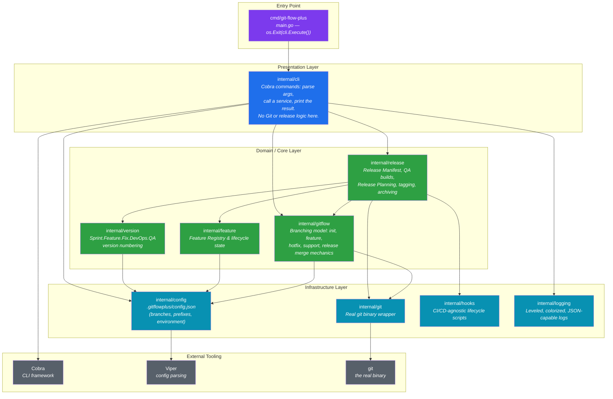

**Key takeaway:** business logic never lives in `internal/cli` — a
command handler is always "load config → call one service method → print
the result." Every package with git-touching logic is independently
unit-testable via injected interfaces (`git.Client`, `gitflow.Service`,
config/version/feature/release `Loader`s).

---

## 19. Package Dependency Diagram

**Purpose:** the literal, verified Go import graph — every arrow below is
a real `import` statement, not an approximation. Used for architecture
review and confirming there are no import cycles (there are none; the
graph is a DAG).

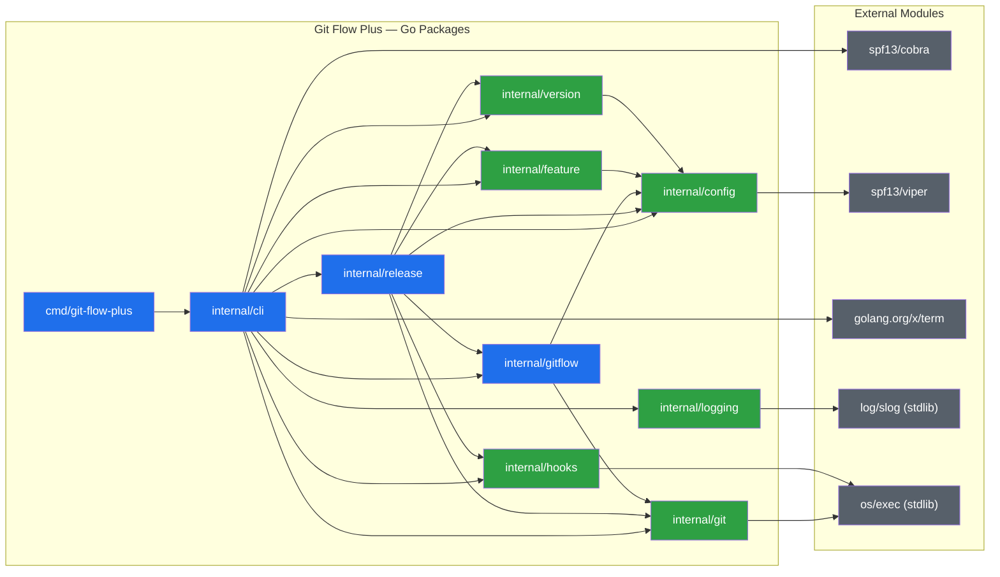

**Key takeaway:** `internal/gitflow` and `internal/git` know nothing about
release management, versions, or manifests — `internal/release` composes
on top of them, never the reverse. This is what lets `internal/gitflow`
stay a reusable, standalone "Git Flow branching engine" in principle,
independent of the release-management features built on top of it.

---

## 17. Domain-Driven Design Architecture

**Purpose:** the same system, viewed through bounded contexts rather than
Go packages — useful for reasoning about where a new business rule
belongs, independent of file layout.

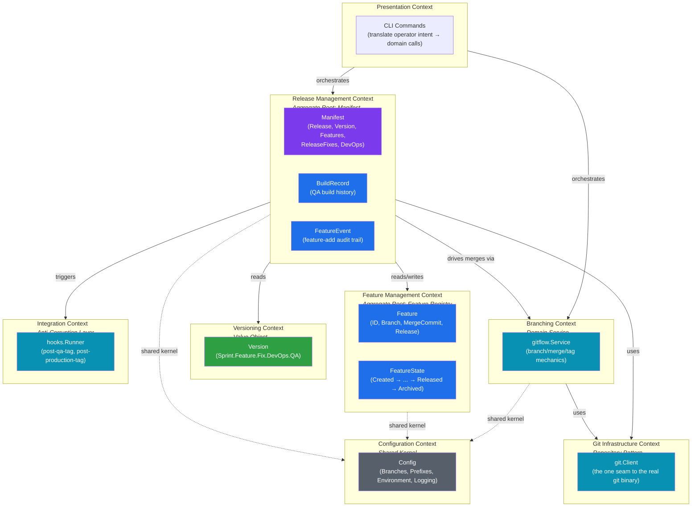

**Key takeaway:** `Manifest` is the aggregate root for a release cycle —
everything about "what's in this release" is reached through it. The
Feature Registry is a *separate* aggregate on purpose: a feature's
lifecycle outlives any single release cycle (it can sit `Pending` across
several planning rounds), while `Manifest` is reset every cycle.

---

## 18. Clean Architecture Layers

**Purpose:** the same system again, viewed through Clean
Architecture/Hexagonal rings — what's a stable domain rule vs. a
swappable implementation detail.

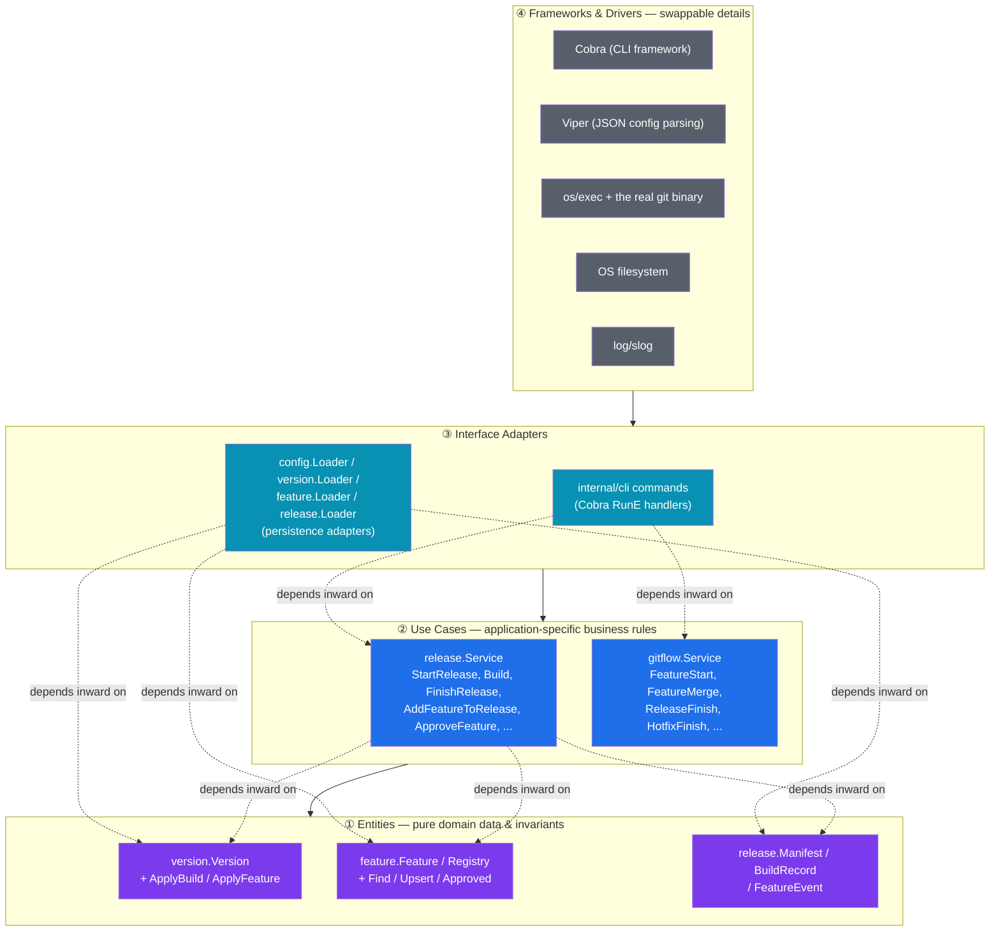

**Key takeaway:** the dependency rule holds throughout the codebase —
`internal/release`/`internal/gitflow` (Use Cases) never import
`internal/cli` (Adapters), and none of the domain code imports Cobra,
Viper, or `os/exec` directly. Everything that touches the OS or a
third-party framework is reached through an injected interface, which is
exactly what makes the fake-based unit tests possible (see
`DeveloperGuide.md`, once published).

---

## 8. Branch Relationship Diagram

**Purpose:** which branches exist, which are permanent vs. ephemeral, and
which branch spawns/merges into which. This is the diagram that makes the
"`develop` is not part of the release lifecycle" rule visually obvious.

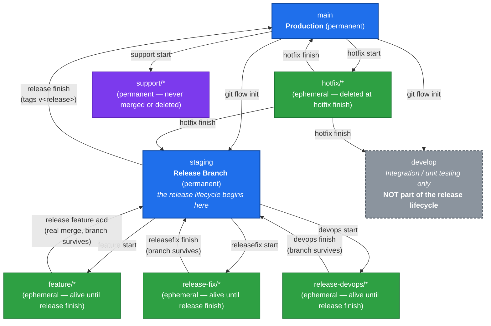

A concrete topology, showing one full cycle end to end (illustrative
branch names use hyphens instead of slashes purely for Mermaid `gitGraph`
compatibility — the real branch names use `/`, e.g. `feature/LOGIN`):

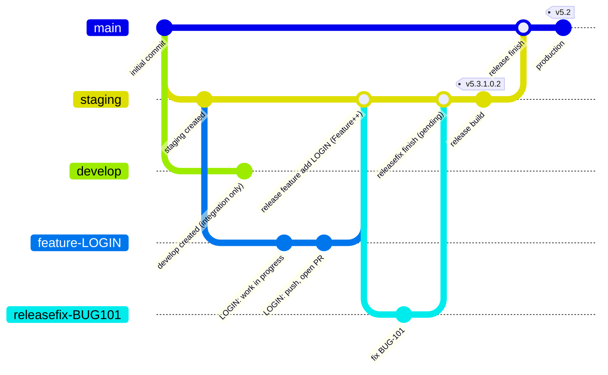

**Key takeaway:** every branch that's part of the release
(`feature/*`, `release-fix/*`, `release-devops/*`) survives its merge —
none of them are deleted until `release finish` runs. `develop` never
receives a merge from `staging` or `main` through the release path at
all; the only thing that ever touches it (besides `git flow init`
creating it) is `hotfix finish`, which is a separate, production-incident
flow, not part of Release Planning.

---

## 20. Branch Resolver Architecture

**Purpose:** *how* a raw command like `git flow feature start LOGIN`
turns into an actual branch name and an actual `git` invocation — this is
the mechanism behind "branch names are configurable through
`.gitflowplus/config.json`."

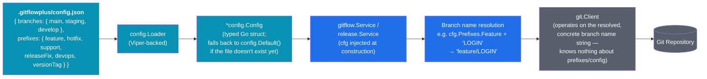

The same resolution, as a concrete call sequence for
`git flow feature start LOGIN`:

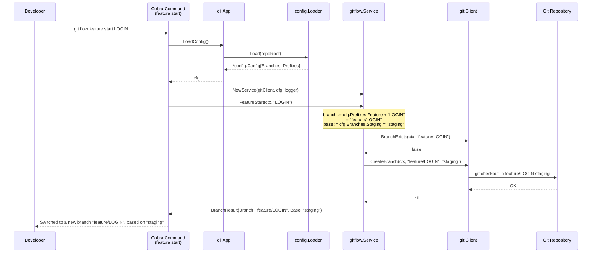

**Key takeaway:** `internal/git` never sees the word "feature" or
"staging" as concepts — it only ever receives fully-resolved string
branch names. All prefix/branch-name knowledge lives in `config.Config`
and is resolved exactly once, inside `internal/gitflow`/`internal/release`,
before it ever reaches the Git layer. Rename `staging` to `release` (or
`feature/` to `feat/`) in `config.json`, and every command adapts with no
code change.

---

## 3. Feature Lifecycle (State Machine)

**Purpose:** the explicit state machine backing `internal/feature` —
`State.AtLeast()` uses the ordinal values shown on each transition, so
e.g. a feature already `IncludedInRelease` still satisfies an `Approved`
check.

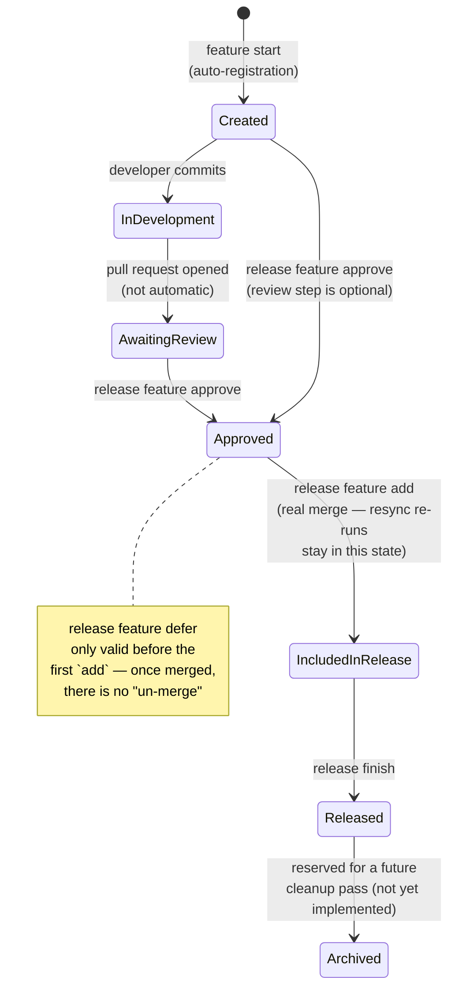

**Key takeaway:** ordinals `0`–`6` (`Created` … `Archived`) exist purely so
`AtLeast()` can do a single integer comparison instead of an explicit
allow-list — the state machine itself has no other numeric meaning.

---

## 4. Release Lifecycle

**Purpose:** the release-manifest-centric view — what `release.json` looks
like at each stage, independent of which specific features/fixes are in
it.

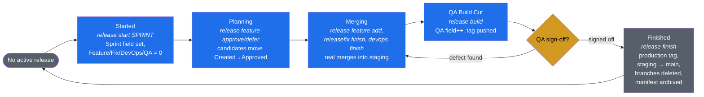

**Key takeaway:** `release start` refuses a second concurrent release
(`ErrReleaseAlreadyActive`), so this whole lifecycle is a single-threaded
loop — the `QALOOP → MERGING` edge is the resync cycle from
[§15 QA Iteration Lifecycle](#15-qa-iteration-lifecycle-in-the-slide-deck),
and it can repeat any number of times before `FINISHED`.

---

## 5. QA Build Lifecycle

**Purpose:** exactly what changes on each `release build` call —
the only command that touches the version's 5th field.

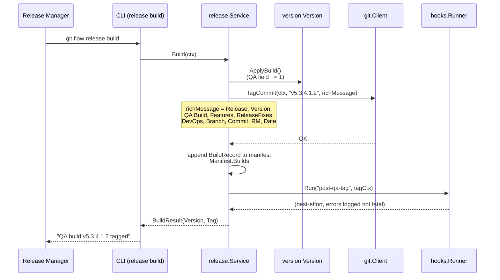

**Key takeaway:** `Build` never merges anything — it only tags and
increments the QA counter. All merging happens earlier, via
`release feature add` / `releasefix finish` / `devops finish`.

---

## 6. Release Fix Workflow

**Purpose:** the release-fix branch's full path, contrasted with a
feature branch — it starts and ends on `staging` directly, with no
Release Manager approval gate (any developer can finish their own fix).

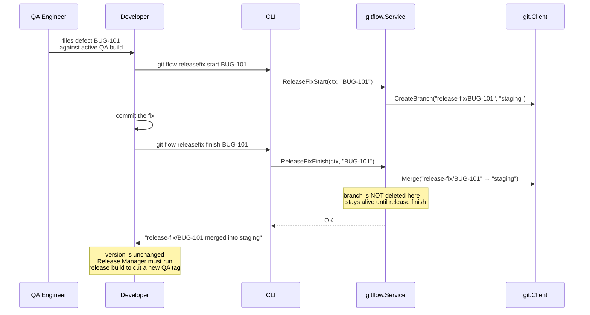

**Key takeaway:** unlike a feature, a release fix needs no
`release feature approve`/`add` step — merging is self-service, because
the defect was already found during this release's own QA cycle. The
version only moves when `release build` runs next.

---

## 7. DevOps Workflow

**Purpose:** `devops start`/`finish` mirrors the release-fix shape
exactly, but the branch is scoped to infrastructure/pipeline changes and
tracked in a separate `devops` bucket in the manifest.

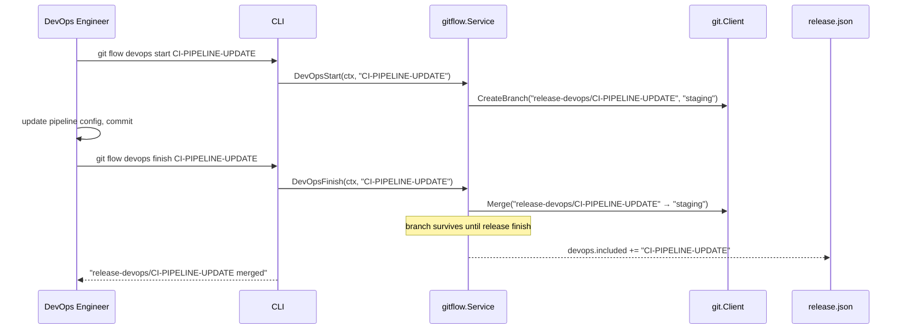

**Key takeaway:** DevOps changes never bump the version by themselves —
same as a release fix, only `release build` (QA field) and
`release feature add` (Feature field) move version numbers; DevOps merges
only move the manifest's `devops.included` list.

---

## 9. Version Increment Flow

**Purpose:** which of the five `Sprint.Feature.ReleaseFix.DevOps.QA`
fields each command touches — the single most-asked question in
onboarding, made visual.

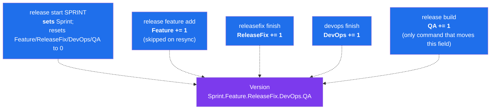

**Key takeaway:** every field has exactly one command that can move it —
there is no path in the codebase where two fields change from a single
action, which is what makes the version string an unambiguous audit
summary on its own.

---

## 10. Release Manager Responsibilities

**Purpose:** everything gated behind the Release Manager role, grouped by
release phase.

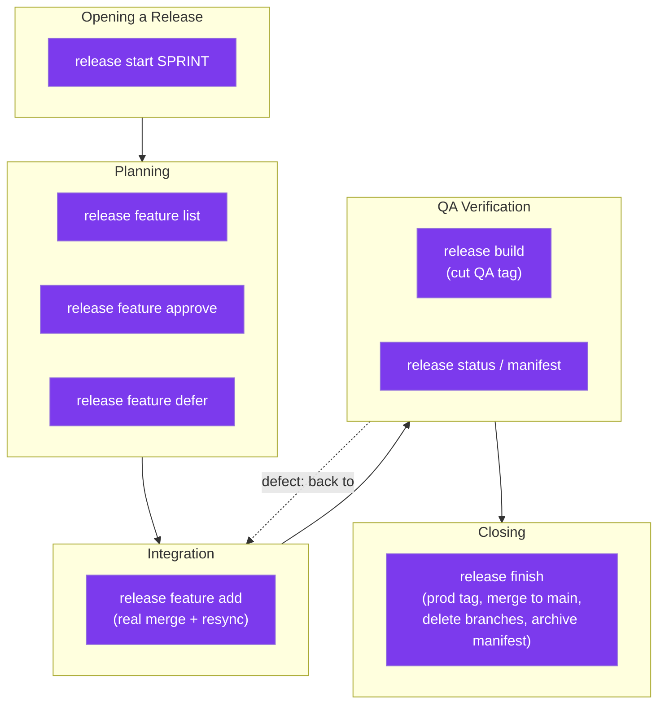

**Key takeaway:** every command in this diagram is Release-Manager-only —
a developer or QA engineer has read access (`status`/`manifest`/`list`)
but no write path into any of these boxes.

---

## 11. Developer Responsibilities

**Purpose:** the mirror image of §10 — everything a developer can do, and
the explicit boundary (there is no `feature finish`) where their
responsibility ends.

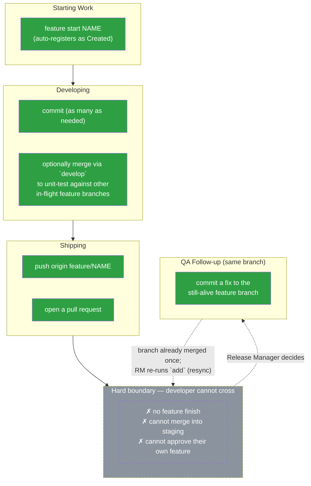

**Key takeaway:** the only two developer actions that exist *after* a
feature has been merged are "commit a fix" and "wait" — every state
transition past that point belongs to the Release Manager.

---

## 12. Build History Lifecycle

**Purpose:** `Manifest.Builds []BuildRecord` — the append-only list every
`release build` call writes to, and what happens to it at `release
finish`.

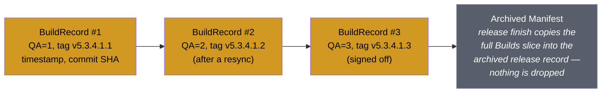

**Key takeaway:** `Builds` is strictly additive for the life of a release
— nothing is ever overwritten or removed, so "how many QA cycles did
release 5.3 take" is always answerable from the archived manifest alone.

---

## 13. Manifest Lifecycle

**Purpose:** `release.json`'s own life, from creation to archival —
distinct from the release lifecycle in §4, which is about *state*; this
is about the *file*.

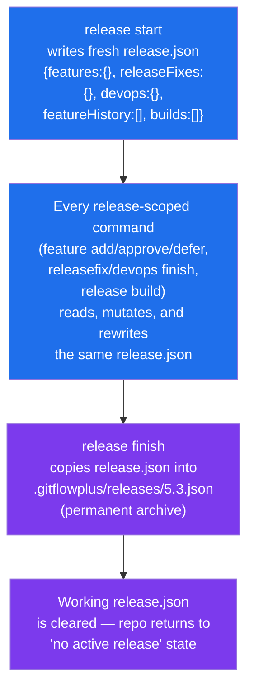

**Key takeaway:** there is exactly one *live* `release.json` at a time
(enforced by `ErrReleaseAlreadyActive`), but an unlimited, permanent
history of *archived* ones — past releases stay queryable forever, they
just aren't the one being mutated.

---

## 14. Git Tag Lifecycle

**Purpose:** the tag timeline across a release, and the distinction
between a QA tag and the single production tag — the source diagram for
[Slide 13 of the training deck](#git-tag-strategy).

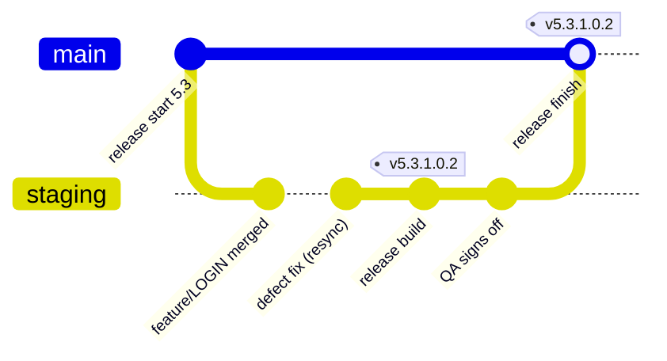

**Key takeaway:** the production tag always lands on the exact same
version string as the last QA-signed-off build — that equality is the
proof that what QA tested is what shipped, not a separately-built
artifact.

---

## 15. Complete SDLC Flow

**Purpose:** the single end-to-end picture — every actor, every branch,
every command, one release from open to close. This is the diagram
[Slide 16 of the training deck](#complete-release-lifecycle) is built
from.

```mermaid
graph TB
    RM1["Release Manager:<br/>release start 5.3"]
    DEV1["Developers:<br/>feature start (parallel, many)"]
    PR["Developers:<br/>commit, push, open PRs"]
    RM2["Release Manager:<br/>review, approve, add<br/>(real merges into staging)"]
    RM3["Release Manager:<br/>release build<br/>(QA tag cut)"]
    QA1["QA Engineer:<br/>test the tagged build"]
    DECIDE{"Defects found?"}
    FIXPATH["Developer/DevOps:<br/>commit fix to same branch<br/>(feature / release-fix / devops)"]
    RESYNC["Release Manager:<br/>re-run add / finish<br/>(resync, no double-count)"]
    SIGNOFF["QA Engineer:<br/>sign off"]
    RM4["Release Manager:<br/>release finish<br/>(prod tag, staging→main,<br/>branch cleanup, archive)"]
    PROD(["Production"])

    RM1 --> DEV1 --> PR --> RM2 --> RM3 --> QA1 --> DECIDE
    DECIDE -->|"yes"| FIXPATH --> RESYNC --> RM3
    DECIDE -->|"no"| SIGNOFF --> RM4 --> PROD

    classDef rm fill:#7c3aed,color:#fff;
    classDef dev fill:#2ea043,color:#fff;
    classDef qa fill:#d29922,color:#000;
    classDef decision fill:#8b949e,color:#fff;
    classDef prod fill:#1f6feb,color:#fff;
    class RM1,RM2,RM3,RM4,RESYNC rm;
    class DEV1,PR,FIXPATH dev;
    class QA1,SIGNOFF qa;
    class DECIDE decision;
    class PROD prod;
```

**Key takeaway:** there is exactly one path to `Production`, and it
always passes through `release finish` — no actor, including the Release
Manager, has a shortcut around it.

---

## 16. Command Interaction Diagram

**Purpose:** which commands read vs. write each piece of persistent
state (`config.json`, `features.json`, `release.json`, Git itself) — the
diagram to check before adding a new command, to see what it should and
shouldn't touch.

```mermaid
graph LR
    subgraph CMDS["Commands"]
        INIT["init"]
        FSTART["feature start"]
        RFA2["release feature add"]
        RFXF["releasefix finish"]
        DOF["devops finish"]
        RBUILD["release build"]
        RFINISH["release finish"]
        STATUS["release status /<br/>manifest / version"]
    end

    subgraph STATE["Persistent State"]
        CFGJSON["config.json"]
        FEATJSON["features.json"]
        RELJSON["release.json"]
        GITSTATE[("Git branches, commits, tags")]
    end

    INIT -->|"write"| CFGJSON
    INIT -->|"write"| GITSTATE
    FSTART -->|"read"| CFGJSON
    FSTART -->|"write"| FEATJSON
    FSTART -->|"write"| GITSTATE
    RFA2 -->|"read"| FEATJSON
    RFA2 -->|"write"| FEATJSON
    RFA2 -->|"write"| RELJSON
    RFA2 -->|"write"| GITSTATE
    RFXF -->|"write"| RELJSON
    RFXF -->|"write"| GITSTATE
    DOF -->|"write"| RELJSON
    DOF -->|"write"| GITSTATE
    RBUILD -->|"write"| RELJSON
    RBUILD -->|"write"| GITSTATE
    RFINISH -->|"write"| FEATJSON
    RFINISH -->|"write"| RELJSON
    RFINISH -->|"write"| GITSTATE
    STATUS -->|"read only"| RELJSON

    classDef cmd fill:#1f6feb,color:#fff;
    classDef state fill:#57606a,color:#fff;
    class INIT,FSTART,RFA2,RFXF,DOF,RBUILD,RFINISH,STATUS cmd;
    class CFGJSON,FEATJSON,RELJSON,GITSTATE state;
```

**Key takeaway:** `release status`/`manifest`/`version` are the only
read-only commands in the whole tool — every other command listed here
writes to at least `GITSTATE`, which is why Git Flow Plus has no
"dry-run" mode: every mutating command's effect is a real, inspectable
Git operation, not a simulated one.

---

## What's next

All 20 originally-scoped diagrams are now delivered across Phases 1 and
2. Remaining work in the documentation initiative:

- [ ] **Phase 3** — the full documentation set (Architecture.md rewrite,
      new Workflow.md/ReleaseManagerGuide.md/QAProcess.md/
      PresentationNotes.md, CommandReference.md rewrite)
- [ ] **Phase 5** — the live demo script (a fuller, standalone document
      beyond the in-deck Slide 18 demo script and speaker notes)
- [ ] README.md rewrite with embedded architecture/workflow diagrams and
      a FAQ section
