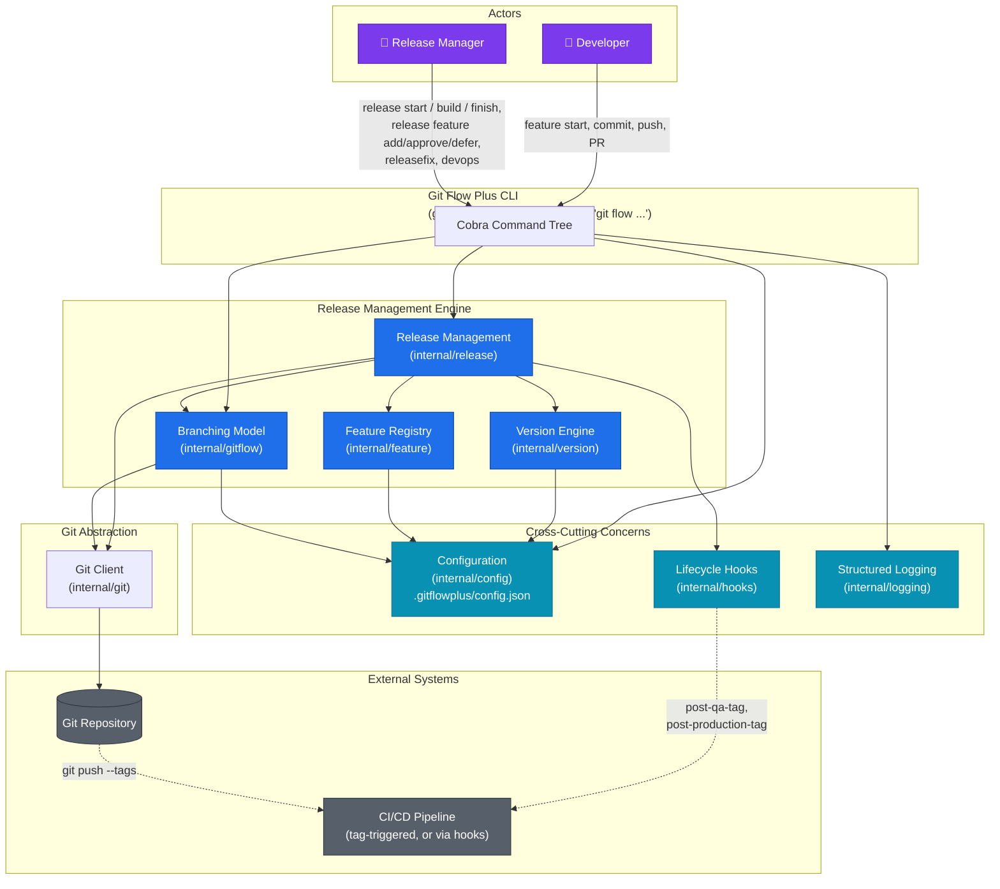
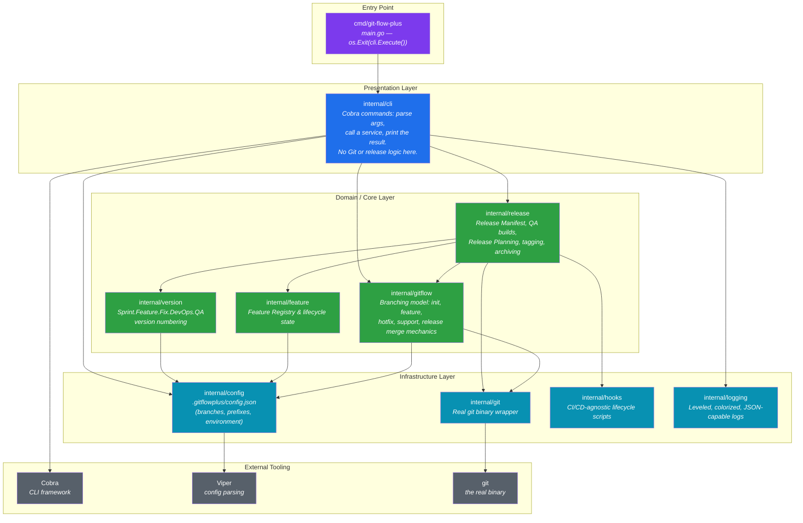
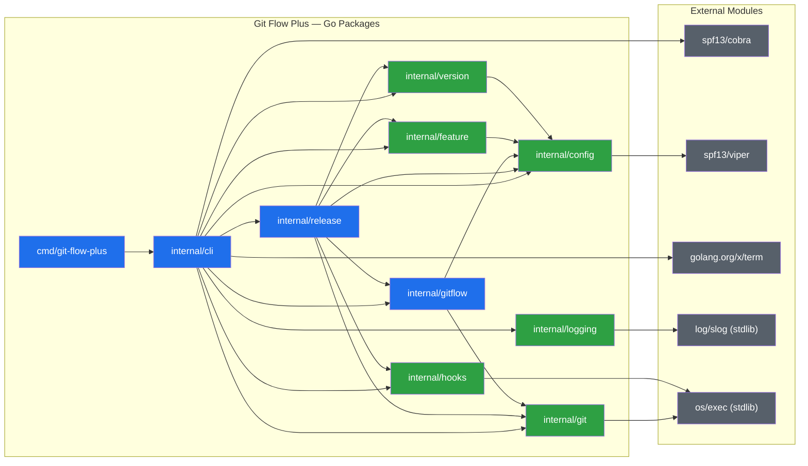
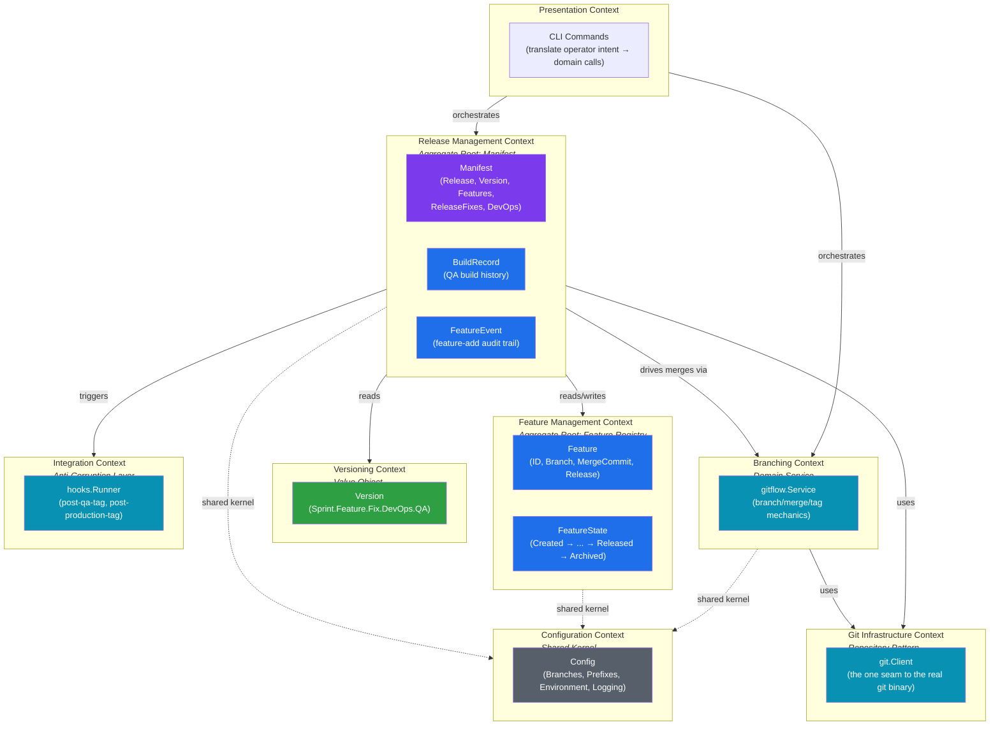
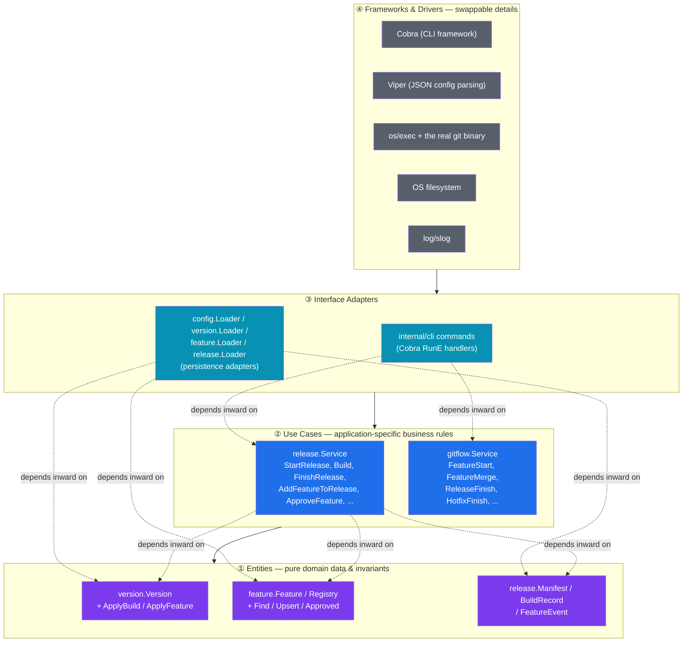
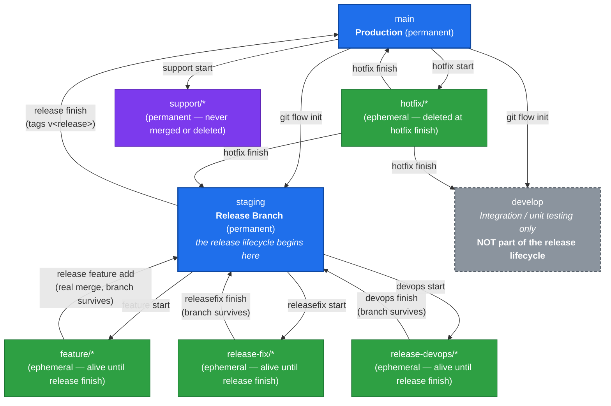
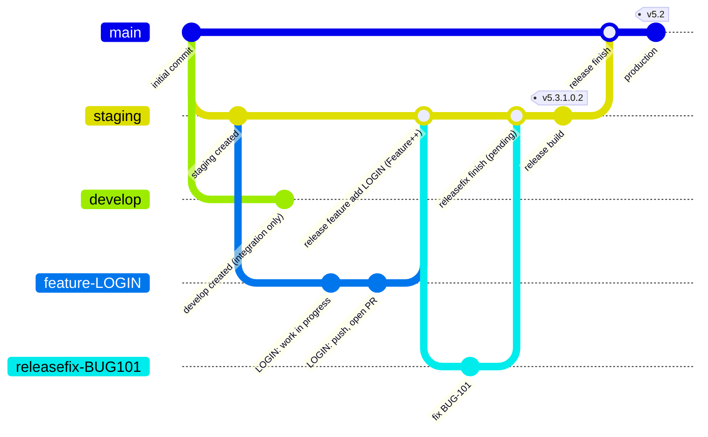
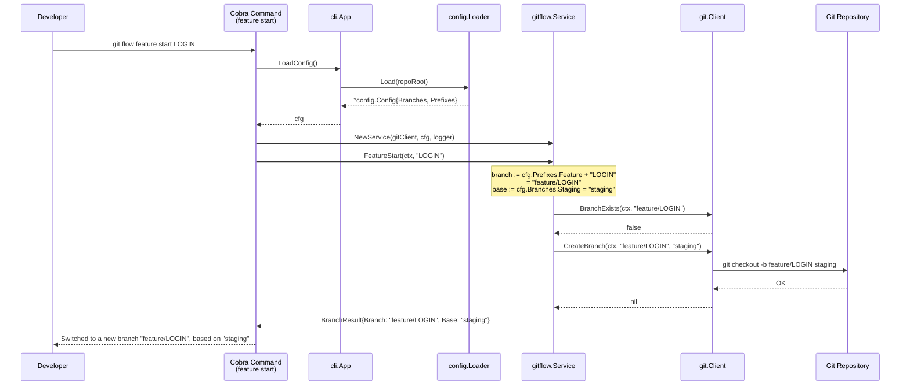

# Git Flow Plus — Diagrams

All diagrams use [Mermaid](https://mermaid.js.org/) syntax and render
natively on GitHub, in VS Code (with the Mermaid extension), in Obsidian,
and in any standard Markdown pipeline that supports Mermaid — no external
tools needed.

This file is being built **incrementally** across five phases, per the
current documentation initiative:

- [x] **Phase 1 — Architecture diagrams** (this delivery)
- [ ] Phase 2 — Workflow / lifecycle diagrams
- [ ] Phase 3 — Full documentation set (Architecture.md, Workflow.md,
      DeveloperGuide.md, ReleaseManagerGuide.md, QAProcess.md,
      CommandReference.md, PresentationNotes.md)
- [ ] Phase 4 — PowerPoint deck (`GitFlowPlus-Demo.pptx`)
- [ ] Phase 5 — Live demo script

Every diagram below reflects the **actual current implementation** —
verified directly against the Go source (package imports, service
interfaces, branch/prefix configuration) as of this session, not the
originally-planned design. Where the real codebase includes more than the
minimum described in the request (e.g. `hotfix`/`support` branches, three
long-lived branches rather than two), the diagrams include it, since the
goal is that these match the codebase exactly.

---

## 1. Overall Git Flow Plus Architecture

**Purpose:** the single "explain it in one picture" view — who uses the
tool, what it's built from, and what it talks to. This is the diagram for
an audience that has never seen the tool before.



**Key takeaway:** Git Flow Plus is a thin, predictable layer over real
`git` — nothing it does is something a `git` command line couldn't also
do. Every mutation flows through `internal/git`, so the repository stays
100% compatible with GitHub, GitLab, Azure DevOps, and any Git-aware tool.

---

## 2. System Components

**Purpose:** a component-level view for engineers onboarding to the
codebase — what each Go package is *responsible for*, grouped by role.
(For the exact import graph, see [§19 Package Dependency
Diagram](#19-package-dependency-diagram) below.)



**Key takeaway:** business logic never lives in `internal/cli` — a
command handler is always "load config → call one service method → print
the result." Every package with git-touching logic is independently
unit-testable via injected interfaces (`git.Client`, `gitflow.Service`,
config/version/feature/release `Loader`s).

---

## 19. Package Dependency Diagram

**Purpose:** the literal, verified Go import graph — every arrow below is
a real `import` statement, not an approximation. Used for architecture
review and confirming there are no import cycles (there are none; the
graph is a DAG).



**Key takeaway:** `internal/gitflow` and `internal/git` know nothing about
release management, versions, or manifests — `internal/release` composes
on top of them, never the reverse. This is what lets `internal/gitflow`
stay a reusable, standalone "Git Flow branching engine" in principle,
independent of the release-management features built on top of it.

---

## 17. Domain-Driven Design Architecture

**Purpose:** the same system, viewed through bounded contexts rather than
Go packages — useful for reasoning about where a new business rule
belongs, independent of file layout.



**Key takeaway:** `Manifest` is the aggregate root for a release cycle —
everything about "what's in this release" is reached through it. The
Feature Registry is a *separate* aggregate on purpose: a feature's
lifecycle outlives any single release cycle (it can sit `Pending` across
several planning rounds), while `Manifest` is reset every cycle.

---

## 18. Clean Architecture Layers

**Purpose:** the same system again, viewed through Clean
Architecture/Hexagonal rings — what's a stable domain rule vs. a
swappable implementation detail.



**Key takeaway:** the dependency rule holds throughout the codebase —
`internal/release`/`internal/gitflow` (Use Cases) never import
`internal/cli` (Adapters), and none of the domain code imports Cobra,
Viper, or `os/exec` directly. Everything that touches the OS or a
third-party framework is reached through an injected interface, which is
exactly what makes the fake-based unit tests possible (see
`DeveloperGuide.md`, once published).

---

## 8. Branch Relationship Diagram

**Purpose:** which branches exist, which are permanent vs. ephemeral, and
which branch spawns/merges into which. This is the diagram that makes the
"`develop` is not part of the release lifecycle" rule visually obvious.



A concrete topology, showing one full cycle end to end (illustrative
branch names use hyphens instead of slashes purely for Mermaid `gitGraph`
compatibility — the real branch names use `/`, e.g. `feature/LOGIN`):



**Key takeaway:** every branch that's part of the release
(`feature/*`, `release-fix/*`, `release-devops/*`) survives its merge —
none of them are deleted until `release finish` runs. `develop` never
receives a merge from `staging` or `main` through the release path at
all; the only thing that ever touches it (besides `git flow init`
creating it) is `hotfix finish`, which is a separate, production-incident
flow, not part of Release Planning.

---

## 20. Branch Resolver Architecture

**Purpose:** *how* a raw command like `git flow feature start LOGIN`
turns into an actual branch name and an actual `git` invocation — this is
the mechanism behind "branch names are configurable through
`.gitflowplus/config.json`."

```mermaid
graph LR
    JSON["<b>.gitflowplus/config.json</b><br/>{ branches: { main, staging, develop },<br/>prefixes: { feature, hotfix, support,<br/>releaseFix, devops, versionTag } }"]
    LOADER["config.Loader<br/>(Viper-backed)"]
    CFGOBJ["*config.Config<br/>(typed Go struct;<br/>falls back to config.Default()<br/>if the file doesn't exist yet)"]
    SVC["gitflow.Service /<br/>release.Service<br/>(cfg injected at construction)"]
    RESOLVE["Branch name resolution<br/>e.g. cfg.Prefixes.Feature + \"LOGIN\"<br/>→ \"feature/LOGIN\""]
    GITCLIENTRESOLVE["git.Client<br/>(operates on the resolved,<br/>concrete branch name string —<br/>knows nothing about prefixes/config)"]
    REPORESOLVE[("Git Repository")]

    JSON --> LOADER
    LOADER --> CFGOBJ
    CFGOBJ --> SVC
    SVC --> RESOLVE
    RESOLVE --> GITCLIENTRESOLVE
    GITCLIENTRESOLVE --> REPORESOLVE

    classDef config fill:#0891b2,color:#fff;
    classDef domain fill:#1f6feb,color:#fff;
    classDef infra fill:#57606a,color:#fff;

    class JSON,LOADER,CFGOBJ config;
    class SVC,RESOLVE domain;
    class GITCLIENTRESOLVE,REPORESOLVE infra;
```

The same resolution, as a concrete call sequence for
`git flow feature start LOGIN`:



**Key takeaway:** `internal/git` never sees the word "feature" or
"staging" as concepts — it only ever receives fully-resolved string
branch names. All prefix/branch-name knowledge lives in `config.Config`
and is resolved exactly once, inside `internal/gitflow`/`internal/release`,
before it ever reaches the Git layer. Rename `staging` to `release` (or
`feature/` to `feat/`) in `config.json`, and every command adapts with no
code change.

---

## What's next

**Phase 2 (next delivery)** covers the remaining 13 diagrams from the
original list — all lifecycle/workflow-oriented: Feature Lifecycle,
Release Lifecycle, QA Build Lifecycle, Release Fix Workflow, DevOps
Workflow, Version Increment Flow, Release Manager Responsibilities,
Developer Responsibilities, Build History Lifecycle, Manifest Lifecycle,
Git Tag Lifecycle, Complete SDLC Flow, and Command Interaction Diagram.
