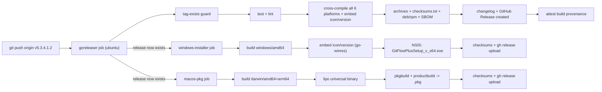

# Release Process

How a Git Flow Plus maintainer cuts a release. This is about releasing
**Git Flow Plus itself** (the tool) — for the release lifecycle Git Flow
Plus manages *for a project that uses it*, see
[ReleaseManagement.md](ReleaseManagement.md).

## The short version

```bash
git tag v5.3.4.1.2
git push origin v5.3.4.1.2
```

Pushing a tag matching `v*` is the entire trigger. Everything else —
testing, linting, cross-compiling, packaging, checksumming, changelog
generation, publishing the GitHub Release, building and attaching the
Windows installer and macOS `.pkg` — happens automatically in
`.github/workflows/release.yml`. There is no separate manual packaging
step; if the tag builds and publishes, the release is done.

## What the tag should look like

Any `v*` tag triggers the pipeline, but tag content flows directly into
build artifacts: it becomes `cli.Version` (via `-ldflags`), the Windows
installer's `DisplayVersion` and embedded `VIProductVersion`, and the
GitHub Release's title — see
[Packaging.md#versioning](Packaging.md#versioning) for the exact
mapping, including the 5-field-to-4-field Windows truncation rule.
Use `vSprint.Feature.ReleaseFix.DevOps.QA` (Git Flow Plus's own version
format, e.g. `v5.3.4.1.2`) once the project is versioning itself that
way; a plain `vMAJOR.MINOR.PATCH` semver tag also works during any
pre-1.0 period — the pipeline doesn't require a specific field count,
only the leading `v`.

## Before the pipeline runs at all: the tag-exists guard

The `goreleaser` job's first real step checks
`gh release view "$GITHUB_REF_NAME"` and fails the run immediately
(`::error::...`) if a release for that tag already exists, rather than
letting GoReleaser attempt to publish over it. GitHub Releases are
treated as **immutable** here: neither this guard nor the Windows/macOS
upload steps ever use `gh release upload --clobber`, so re-running a job
against an already-published release fails loudly instead of silently
overwriting a published artifact. A genuinely bad release is fixed by
yanking it and pushing a new tag, not by mutating one that already
shipped.

## The pipeline, job by job



1. **`goreleaser`** (ubuntu-latest) — after the tag-exists guard above,
   runs `go test ./...` and `golangci-lint run`, installs `syft`, then
   `goreleaser release --clean`. This one step cross-compiles all 6
   `GOOS`/`GOARCH` targets, archives them, writes `checksums.txt`,
   generates one SBOM per archive, builds `.deb`/`.rpm`, generates a
   changelog from commit history, and **creates the GitHub Release** —
   every later job depends on this release already existing, since they
   attach to it rather than creating their own. A final step attests
   build provenance (`actions/attest-build-provenance@v2`) for every
   archive, package, and SBOM — see
   [Build provenance attestation](#build-provenance-attestation) below.
2. **`windows-installer`** (windows-latest, `needs: goreleaser`) —
   independently rebuilds the `windows/amd64` binary with matching
   `-ldflags` (simpler and just as fast as passing artifacts between
   jobs on different runners) after embedding the icon/version resource
   via `go-winres`, compiles the NSIS installer via
   [build/windows/create-installer.ps1](build/windows/create-installer.ps1),
   generates `windows-checksums.txt`, and `gh release upload`s both to
   the release the first job created.
3. **`macos-pkg`** (macos-latest, `needs: goreleaser`) — same idea:
   rebuilds the darwin binaries, runs
   [scripts/package-macos-pkg.sh](scripts/package-macos-pkg.sh) to
   produce a universal `.pkg`, checksums it, uploads it.

Windows and macOS run as **separate jobs**, not inside GoReleaser
itself, because NSIS and `lipo`/`pkgbuild`/`productbuild` only exist on
their native OS — GoReleaser can cross-compile Go binaries for any
platform from one runner, but it can't cross-*package* a platform-native
installer.

## Build provenance attestation

The `goreleaser` job's final step runs
`actions/attest-build-provenance@v2` over every archive, `.deb`/`.rpm`,
and SBOM it produced (`permissions: id-token: write, attestations:
write` at the workflow level enable this). This creates a verifiable,
signed record — hosted by GitHub, not this repository — of exactly
which workflow run, commit, and source repository produced a given
artifact. Anyone can verify a downloaded artifact wasn't tampered with
or substituted after the fact:

```bash
gh attestation verify git-flow-plus-linux-amd64.tar.gz --repo tabnaeem/git-flow-plus
```

The Windows installer and macOS `.pkg` are built in their own,
separate jobs (see above) and are not currently covered by this
attestation step — a candidate follow-up, not a gap in the core
archives/packages GoReleaser itself produces.

## Verifying a release after it publishes

```bash
curl -sL https://github.com/tabnaeem/git-flow-plus/releases/download/v5.3.4.1.2/checksums.txt -o checksums.txt
sha256sum -c checksums.txt --ignore-missing
```

Then smoke-test at least the platform you're on:

```bash
git flow version   # confirms the tag's version made it into the binary
git flow doctor
```

## Before tagging

Everything the release pipeline runs, run locally first — see
[Building.md#local-verification-before-tagging](Building.md#local-verification-before-tagging):

```bash
make check    # fmt, vet, lint, test
make package  # goreleaser --snapshot: the exact same steps, without publishing
```

## After a release: updating ReleaseNotes.md

[ReleaseNotes.md](ReleaseNotes.md) is not auto-generated by the
pipeline (GoReleaser's own changelog goes into the GitHub Release body,
not this file) — rename its `## Unreleased` heading to the version just
tagged (e.g. `## v5.3.4.1.2 — 2026-08-01`) and start a fresh empty
`## Unreleased` section above it, per
[Keep a Changelog](https://keepachangelog.com/) convention.

## See also

- [Building.md](Building.md) — the underlying build commands
- [Packaging.md](Packaging.md) — how each artifact is assembled
- [UpgradeGuide.md](UpgradeGuide.md) — what a release means for existing installs
