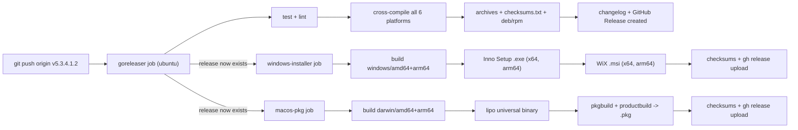

# Release Process

How a Git Flow Plus maintainer cuts a release. This is about releasing
**Git Flow Plus itself** (the tool) — for the release lifecycle Git Flow
Plus manages *for a project that uses it*, see
[ReleaseManagement.md](ReleaseManagement.md).

## The short version

```bash
git tag v5.3.4.1.2
git push origin v5.3.4.1.2
```

Pushing a tag matching `v*` is the entire trigger. Everything else —
testing, linting, cross-compiling, packaging, checksumming, changelog
generation, publishing the GitHub Release, building and attaching the
Windows installer and macOS `.pkg` — happens automatically in
`.github/workflows/release.yml`. There is no separate manual packaging
step; if the tag builds and publishes, the release is done.

## What the tag should look like

Any `v*` tag triggers the pipeline, but tag content flows directly into
build artifacts: it becomes `cli.Version` (via `-ldflags`), the Windows
installers' `AppVersion`/`ProductVersion`, and the GitHub Release's
title — see [Packaging.md#versioning](Packaging.md#versioning) for the
exact mapping, including the 5-field-to-4-field Windows truncation rule.
Use `vSprint.Feature.ReleaseFix.DevOps.QA` (Git Flow Plus's own version
format, e.g. `v5.3.4.1.2`) once the project is versioning itself that
way; a plain `vMAJOR.MINOR.PATCH` semver tag also works during any
pre-1.0 period — the pipeline doesn't require a specific field count,
only the leading `v`.

## The pipeline, job by job



1. **`goreleaser`** (ubuntu-latest) — runs `go test ./...` and
   `golangci-lint run`, then `goreleaser release --clean`. This one step
   cross-compiles all 6 `GOOS`/`GOARCH` targets, archives them, writes
   `checksums.txt`, builds `.deb`/`.rpm`, generates a changelog from
   commit history, and **creates the GitHub Release** — every later job
   depends on this release already existing, since they attach to it
   rather than creating their own.
2. **`windows-installer`** (windows-latest, `needs: goreleaser`) —
   independently rebuilds the `windows/amd64` and `windows/arm64`
   binaries with matching `-ldflags` (simpler and just as fast as
   passing artifacts between jobs on different runners), compiles both
   architectures' Inno Setup `.exe` and WiX `.msi`, generates
   `windows-checksums.txt`, and `gh release upload`s everything to the
   release the first job created.
3. **`macos-pkg`** (macos-latest, `needs: goreleaser`) — same idea:
   rebuilds the darwin binaries, runs
   [scripts/package-macos-pkg.sh](scripts/package-macos-pkg.sh) to
   produce a universal `.pkg`, checksums it, uploads it.

Windows and macOS run as **separate jobs**, not inside GoReleaser
itself, because Inno Setup, WiX, and `lipo`/`pkgbuild`/`productbuild`
only exist on their native OS — GoReleaser can cross-compile Go binaries
for any platform from one runner, but it can't cross-*package* a
platform-native installer.

## Verifying a release after it publishes

```bash
curl -sL https://github.com/tabnaeem/git-flow-plus/releases/download/v5.3.4.1.2/checksums.txt -o checksums.txt
sha256sum -c checksums.txt --ignore-missing
```

Then smoke-test at least the platform you're on:

```bash
git flow version   # confirms the tag's version made it into the binary
git flow doctor
```

## Before tagging

Everything the release pipeline runs, run locally first — see
[Building.md#local-verification-before-tagging](Building.md#local-verification-before-tagging):

```bash
make check    # fmt, vet, lint, test
make package  # goreleaser --snapshot: the exact same steps, without publishing
```

## After a release: updating ReleaseNotes.md

[ReleaseNotes.md](ReleaseNotes.md) is not auto-generated by the
pipeline (GoReleaser's own changelog goes into the GitHub Release body,
not this file) — rename its `## Unreleased` heading to the version just
tagged (e.g. `## v5.3.4.1.2 — 2026-08-01`) and start a fresh empty
`## Unreleased` section above it, per
[Keep a Changelog](https://keepachangelog.com/) convention.

## See also

- [Building.md](Building.md) — the underlying build commands
- [Packaging.md](Packaging.md) — how each artifact is assembled
- [UpgradeGuide.md](UpgradeGuide.md) — what a release means for existing installs
